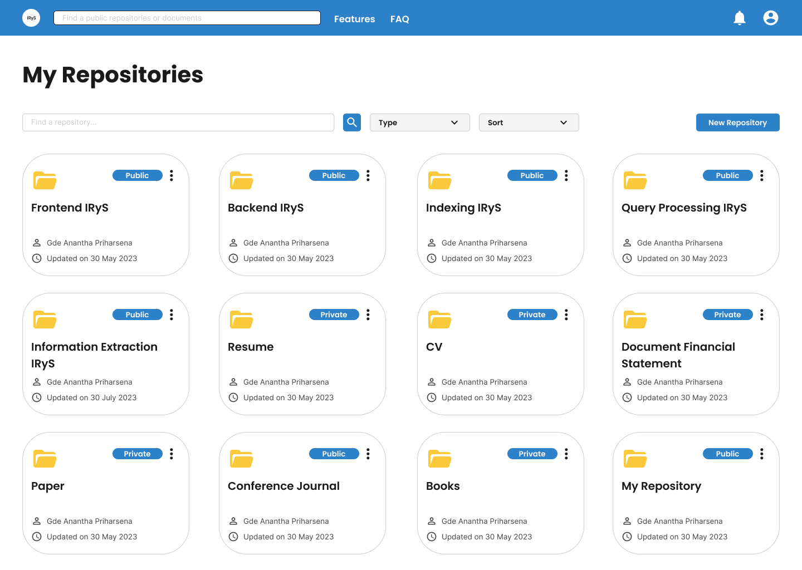

<!-- PROJECT LOGO -->
<div align="center">
<p>
  <a href="https://github.com/IRySTeam/IRyS-BE-V2">
    
  </a>

  <h3 align="center">IRyS</h3>

  <p align="center">
    Intelligent Repository System
    <br/>
    <a href="https://github.com/IRySTeam/IRyS-BE-V2">
      <strong>Explore the docs »</strong>
    </a>
    <br/><br/>
    <a href="https://github.com/IRySTeam/IRyS-BE-V2/issues">Report Bug</a>
    ·
    <a href="https://github.com/IRySTeam/IRyS-BE-V2/discussions/landing">Request Feature</a>
  </p>
</p>
</div>


<!-- TABLE OF CONTENTS -->
## Table of Contents

- [Table of Contents](#table-of-contents)
- [About The Project](#about-the-project)
  - [Built With](#built-with)
- [Getting Started](#getting-started)
- [Requirements](#requirements)
  - [BERT model](#bert-model)
  - [Elasticsearch](#elasticsearch)
    - [Cloud (Recommended)](#cloud-recommended)
    - [Local](#local)
- [Local development](#local-development)
  - [Installing required dependency](#installing-required-dependency)
  - [Configure App](#configure-app)
  - [Database Migration (Optional)](#database-migration-optional)
    - [Migrate Up](#migrate-up)
    - [Migrate Down / Rollback](#migrate-down--rollback)
    - [Add new migration](#add-new-migration)
  - [Running the needed services](#running-the-needed-services)
  - [Running the app](#running-the-app)
- [Usage](#usage)
- [Environment Variables](#environment-variables)
  - [.env](#env)
  - [celery\_app/.env.example](#celery_appenvexample)
  - [bertserving/.env.example](#bertservingenvexample)
- [Maintainers](#maintainers)
- [License](#license)


<!-- ABOUT THE PROJECT -->
## About The Project



IRyS (Intelligent Repository System) is a digital repository system that can be used to store documents and perform search on those documents. When a document is stored, it will be processed to extract important information from the document such as metadata or entities. Search on documents can be performed using semantic similarity between documents combined with corresponding metadata or entities. There are other features such as authentication, notification, repository management, access management, and others.

### Built With

* [fastapi](https://fastapi.tiangolo.com/)
* [elasticsearch](https://www.elastic.co/)
* [tesseract-ocr](https://github.com/tesseract-ocr/tesseract)
* [bert](https://huggingface.co/docs/transformers/model_doc/bert)

<!-- GETTING STARTED -->
## Getting Started

To get a local copy up and running follow these simple steps.

## Requirements
* [Pyenv](https://github.com/pyenv/pyenv) (**Recommended**) for python version management
* Python ^3.8.x
  * To install using pyenv
    ```
    pyenv install 3.8.x
    ```
* [Poetry](https://python-poetry.org/) for Python package and environment management.
* Postgres
* Redis
* BERT model
  * For instructions on how to download BERT model, please refer to [BERT model](#bert-model) section.
* Elasticsearch cloud service
  * For instructions on how to setup Elasticsearch cloud service, please refer to [Elasticsearch](#elasticsearch) section.

### BERT model
You can run following commands to download the BERT model:
```bash
cd bertserving
wget https://storage.googleapis.com/bert_models/2018_10_18/cased_L-12_H-768_A-12.zip
unzip cased_L-12_H-768_A-12.zip
```
<details>
    <summary>List of released pretrained BERT models (click to expand...)</summary>
    <table>
        <tr>
            <td>
                <a href="https://storage.googleapis.com/bert_models/2018_10_18/uncased_L-12_H-768_A-12.zip">BERT-Base, Uncased</a>
            </td>
            <td>12-layer, 768-hidden, 12-heads, 110M parameters</td>
        </tr>
        <tr>
            <td>
                <a href="https://storage.googleapis.com/bert_models/2018_10_18/uncased_L-24_H-1024_A-16.zip">BERT-Large, Uncased</a>
            </td>
            <td>24-layer, 1024-hidden, 16-heads, 340M parameters</td>
        </tr>
        <tr>
            <td>
                <a href="https://storage.googleapis.com/bert_models/2018_10_18/cased_L-12_H-768_A-12.zip">BERT-Base, Cased</a>
            </td>
            <td>12-layer, 768-hidden, 12-heads , 110M parameters</td>
        </tr>
        <tr>
            <td>
                <a href="https://storage.googleapis.com/bert_models/2018_10_18/cased_L-24_H-1024_A-16.zip">BERT-Large, Cased</a>
            </td>
            <td>24-layer, 1024-hidden, 16-heads, 340M parameters</td>
        </tr>
        <tr>
            <td>
                <a href="https://storage.googleapis.com/bert_models/2018_11_23/multi_cased_L-12_H-768_A-12.zip">BERT-Base, Multilingual Cased (New)</a></td><td>104 languages, 12-layer, 768-hidden, 12-heads, 110M parameters
            </td>
        </tr>
        <tr>
            <td>
                <a href="https://storage.googleapis.com/bert_models/2018_11_03/multilingual_L-12_H-768_A-12.zip">BERT-Base, Multilingual Cased (Old)
                </a>
            </td>
            <td>102 languages, 12-layer, 768-hidden, 12-heads, 110M parameters</td>
        </tr>
        <tr>
            <td>
                <a href="https://storage.googleapis.com/bert_models/2018_11_03/chinese_L-12_H-768_A-12.zip">BERT-Base, Chinese</a>
            </td>
            <td>Chinese Simplified and Traditional, 12-layer, 768-hidden, 12-heads, 110M parameters</td>
        </tr>
    </table>
</details>
Note that if you don't download the BERT model in local, the script in the docker will download it for you.

### Elasticsearch
#### Cloud (Recommended)
To setup elasticsearch cloud service, you can follow the steps below:
1. Create an account in [Elastic Cloud](https://www.elastic.co/cloud).
2. Create a new deployment.
3. The deployment will be created in a few minutes. After that, elasticsearch will give you an password for the default user `elastic`. Fill the value of `ELASTICSEARCH_USER` with `elastic` and `ELASTICSEARCH_PASSWORD` with the password given by elastic search.
4. Go to manage deployment page and copy the cloud deplpoyment id and paste it in the `ELASTICSEARCH_CLOUD_ID` environment variable.
5. Create a new API key, and copy the API key and paste it in the `ELASTICSEARCH_API_KEY` environment variable.
6. Set the `ELASTICSEARCH_CLOUD` environment variable to `True`.

#### Local
To setup elasticsearch locally, you can follow the steps below:
1. Install elasticsearch using docker by following this [link](https://www.elastic.co/guide/en/elasticsearch/reference/current/docker.html).
2. Change the `ELASTICSEARCH_CLOUD` environment variable to `False`.
3. Change the `ELASTICSEARCH_HOST` environment variable to `localhost` and `ELASTICSEARCH_SCHEME` to `http`.
4. Change the `ELASTICSEARCH_PORT` to assigned port during installation.

## Local development
### Installing required dependency
1. Install each dependency from the requirements section above.
2. Train the Machine Learning model for document classification by running this command:
    ```zsh
    python3 app/classification/mlutil/classifier_train.py
    ```
3. Install python dependencies
    ```bash
    poetry install
    ```
    NOTE: If you get error while installing `psycopg2-binary` package, try to
    run: `$ poetry run pip install psycopg2-binary` first then re-run `$ poetry install`
4. Install pre-commit git hook (for auto formatting purpose)
    ```
    pre-commit install
    ```
5. Install some additional dependencies such
   1. libmagic:
    ```bash
    sudo apt-get install libmagic1 (Debian/Ubuntu)
    brew install libmagic (Mac)
    pip install python-magic-bin (Windows)
    ```
   2. TODO: Actually there are more dependencies, but they are already installed while running docker-compose. You don't need to install them manually because they are used by celery worker and bert-serving (which is running in docker). But if you want to run those services locally (which is not recommended), you need to install them manually.

### Configure App
1. Find all files below.
   - [`./.env.example`](./.env.example)
   - [`./celery_app/.env.example`](./celery_app/.env.example)
   - [`./bertserving/.env.example`](./bertserving/.env.example)
2. Duplicate those files and rename the duplicate files from `[prefix_name].example` pattern to `[prefix_name]`
3. Open newly created files and adjust the content according to your environment. To see the explanation of each environment variable, you can check the [environment variable section](#environment-variables).

### Database Migration (Optional)
This section is only if you want to run the database locally or you want to add/update the database schema.If you want to use the database from the cloud, you can skip this section.
#### Migrate Up
If you want to migrate the database, you can run the following command.
```bash
alembic upgrade head
```

#### Migrate Down / Rollback
If you want to fully rollback the database, you can run the following command.
```bash
alembic downgrade base
```
If you want to rollback to specific version, you can run the following command.
```bash
alembic downgrade [version]
```
To see the list of available version, you can run the following command.
```bash
alembic history
```

#### Add new migration
If you want to add new migration, you can run the following command to generate new migration file.
```
alembic revision --autogenerate -m "migration message"
```
Dont forget to add the model in [migrations/env.py](./migrations/env.py) file (if not exist).
```python
from app.<folder>.models import *
```

### Running the needed services
Run docker compose by running
```zsh
docker-compose -f docker-compose-local.yml up
```
Below are services that are running:
1. bert-serving: Used for sentence embedding using BERT
2. redis: Used for celery result backend and message broker
3. celery_worker -> Used for running celery tasks
4. celery_beat: Used for running celery beat (cron jobs scheduler)
5. flower: Used for monitoring celery tasks, located at http://localhost:5557

Below are some useful commands for docker:
1. To rebuild docker containers, run
    ```zsh
    docker-compose -f docker-compose-local.yml up --build
    ```
2. To remove unused docker containers, run
    ```zsh
    docker container prune
    ```
3. To remove unused docker images, run
    ```zsh
    docker rmi $(docker images --filter "dangling=true" -q --no-trunc)
    ```
4. To exec into a docker container, run
    ```zsh
    docker exec -it <container_name> bash
    ```

### Running the app
1. Run ```poetry shell``` to open Poetry Shell
2. Install all dependecies by running
    ```bash
    poetry install
    ```
3. Lastly, run the app using this command:
    ```python
    python3 main.py --env local|dev|prod --debug
    ```
<!-- USAGE EXAMPLES -->
## Usage
1. To access the documentation, you can go to [localhost:8000/docs](localhost:8000/docs) on your web browser.

## Environment Variables
### [.env](./.env.example)
| Name | Description | Example Value |
| --- | --- | --- |
| `DEV_DB_HOST` | Database host address | localhost |
| `DEV_DB_USER` | Database user's username | postgres |
| `DEV_DB_PASSWORD` | Database user's password | postgres |
| `DEV_DB_NAME` | Database name used for application | IRyS_v1 |
| `PROD_DB_HOST` | Database host address | localhost |
| `PROD_DB_USER` | Database user username | postgres |
| `PROD_DB_PASSWORD` | Database user password | postgres |
| `PROD_DB_NAME` | Database name used for application | IRyS_v1 |
| `ELASTICSEARCH_CLOUD` | Whether using Elasticsearch Cloud or not | True |
| `ELASTICSEARCH_CLOUD_ID` | Elasticsearch Cloud deployment ID | fcggg111hgg2jjh2:jhhhllk |
| `ELASTICSEARCH_USER` | Elasticsearch username (either using Elasticsearch Cloud or not) | elastic |
| `ELASTICSEARCH_PASSWORD` | Elasticsearch password (either using Elasticsearch Cloud or not) | password |
| `ELASTICSEARCH_API_KEY` | Elasticsearch API key (when using Elasticsearch Cloud) | 1234567890 |
| `ELASTICSEARCH_SCHEME` | Elasticsearch scheme (when using local Elasticsearch) | http |
| `ELASTICSEARCH_HOST` | Elasticsearch host address (when using local Elasticsearch) | localhost |
| `ELASTICSEARCH_PORT` | Elasticsearch port (when using local Elasticsearch) | 9200 |
| `MAIL_USERNAME` | Email username | username |
| `MAIL_PASSWORD` | Email password | password |
| `MAIL_FROM` | Email sender | |
| `MAIL_PORT` | Email port | 587 |
| `MAIL_SERVER` | Email server | smtp.gmail.com |
| `CELERY_BROKER_URL` | Celery broker URL | redis://localhost:6379/0 |
| `CELERY_RESULT_BACKEND` | Celery result backend URL | redis://localhost:6379/0 |

**Note:**
1. More on elasticsearch see [Elasticsearch](#Elasticsearch) section.


### [celery_app/.env.example](./celery_app/.env.example)
| Variable | Description | Default |
| --- | --- | --- |
| `CELERY_BROKER_URL` | The URL of the broker to use. | `redis://redis:6379/0` |
| `CELERY_RESULT_BACKEND` | The URL of the result backend to use. | `redis://redis:6379/0` |

**Note:**
1. The value of `CELERY_BROKER_URL` and `CELERY_RESULT_BACKEND` should be the same as the value of redis configuration in the `docker-compose.yml` file.


### [bertserving/.env.example](./bertserving/.env.example)
| Variable | Description | Default |
| --- | --- | --- |
| `MODEL_DOWNLOAD_URL` | The URL of the BERT model to download. | `https://storage.googleapis.com/bert_models/2018_10_18/uncased_L-12_H-768_A-12.zip` |
| `MODEL_NAME` | The name of the BERT model to download. | `uncased_L-12_H-768_A-12` |

**Note:**
1. More on BERT see [BERT model](#BERT-model) section.
2. The value of `MODEL_NAME` will be used as the name of the folder that contains the BERT model.


<!-- MAINTAINERS -->
## Maintainers
List of Maintainers
* [Gde Anantha Priharsena](mailto:13519026@std.stei.itb.ac.id)
* [Reihan Andhika Putra](mailto:13519043@std.stei.itb.ac.id)
* [Shifa Salsabiila](mailto:13519106@std.stei.itb.ac.id)
* [Reyhan Emyr Arrosyid](mailto:13519167@std.stei.itb.ac.id)
* [Andres Jerriel Sinabutar](mailto:13519218@std.stei.itb.ac.id)

## License
Copyright (c) 2023, [IRyS-Team](https://github.com/IRySTeam).
