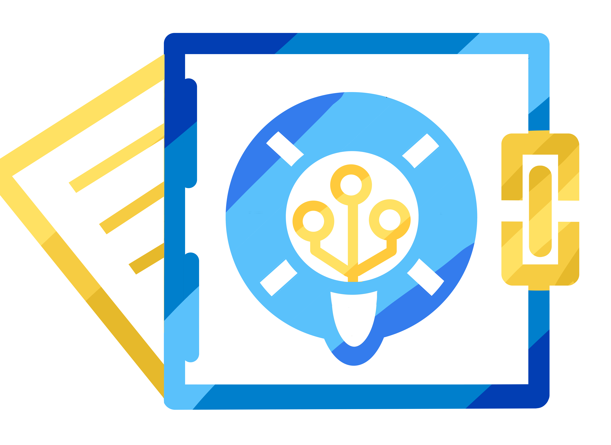

<!-- PROJECT LOGO -->
<div align="center">
<p>
  <a href="https://github.com/IRySTeam/IRyS-BE-V2">
    
  </a>

  <h3 align="center">IRyS</h3>

  <p align="center">
    Intelligent Repository System
    <br/>
    <a href="https://github.com/IRySTeam/IRyS-BE-V2">
      <strong>Explore the docs »</strong>
    </a>
    <br/><br/>
    <a href="https://github.com/IRySTeam/IRyS-BE-V2/issues">Report Bug</a>
    ·
    <a href="https://github.com/IRySTeam/IRyS-BE-V2/discussions/landing">Request Feature</a>
  </p>
</p>
</div>


<!-- TABLE OF CONTENTS -->
## Table of Contents

- [Table of Contents](#table-of-contents)
- [About The Project](#about-the-project)
  - [Built With](#built-with)
- [Getting Started](#getting-started)
- [Requirements](#requirements)
- [Local development](#local-development)
  - [Installing required dependency](#installing-required-dependency)
  - [Configure App](#configure-app)
  - [Configure Keycloak in Development](#configure-keycloak-in-development)
  - [Running the app](#running-the-app)
- [Usage](#usage)
- [Roadmap](#roadmap)
- [Maintainers](#maintainers)
- [Acknowledgements](#acknowledgements)
- [License](#license)


<!-- ABOUT THE PROJECT -->
## About The Project


Meeting analytics is Web App to help user transcribe their meeting in realtime and non-realtime mode

### Built With

* [django](https://www.djangoproject.com)
* [django-ninja](https://django-ninja.rest-framework.com/)
* [python-socketio](https://python-socketio.readthedocs.io/en/latest/)
* [arq](https://arq-docs.helpmanual.io/)
* [keycloak](https://www.keycloak.org/)


<!-- GETTING STARTED -->
## Getting Started

To get a local copy up and running follow these simple steps.

## Requirements
* [Pyenv](https://github.com/pyenv/pyenv) (**Recommended**) for python version management
* Python 3.9.13 
  * To install using pyenv
    ```
    pyenv install 3.9.13
    ``` 
* [Poetry](https://python-poetry.org/) for Python package and environment management.
* Postgres
* Redis
* Sox
  * Linux (debian based): `sudo apt-get install sox`
  * OSX: `brew install sox`
* Libsndfile
  * Linux (debian based): `sudo apt-get install libsndfile1`
  * On OSX, this dependency is installed alongside the python SoundFile module on the previous step
* FFMPEG
  * OSX: `brew install ffmpeg`
  * Linux (debian based): `sudo apt install ffmpeg`
* ZIP
  * Linux (debian based)L `sudo apt install zip` 
* Keycloak
  * See keycloak requirements [here] (https://www.keycloak.org/docs/15.0/server_installation/). Probably just need to install java 8 JDK.
  * Download Keycloak from [here](https://www.keycloak.org/archive/downloads-15.0.2.html)
  * Extract the zip file to home directory (you can use anoter directory if you want)

## Local development
### Installing required dependency
1. Install each dependency from the requirements section above.
2. config poetry credentials for installing from prosa pypi
    ```
    poetry config http-basic.prosa prosa ProsaCerdasbandung10!
    ```
3. Install python dependencies
    ```
    poetry install
    ```
    NOTE: If you get error while installing `psycopg2-binary` package, try to
    run: `$ poetry run pip install psycopg2-binary` first then re-run `$ poetry install`

4. Install pre-commit git hook (for auto formatting purpose)
    ```
    pre-commit install
    ```

### Configure App
1. Find all files below.
   - [`./config/default.env`](./config/default.env)
   - [`./config/engines-default.yaml`](./config/engines-default.yaml)
   - [`./config/worker_config-default.yaml`](./config/worker_config-default.yaml)
   - [`./meeting_analytics/settings/environments/local.py.default`](./meeting_analytics/settings/environments/local.py.default)
2. Duplicate those files and rename the duplicate files from `[prefix_name]-default.[ext]` or `[prefix_name].[ext].default` pattern to `[prefix_name].[ext]`
3. Open newly created files and adjust the content

### Configure Keycloak in Development
The default keycloak host is on `localhost:8080`. 
1. Make sure you have installed Keycloak (details in requirements section)
2. Go to the Keycloak extracted directory and run the following command:
    ```
    ./bin/standalone.sh 
    ```
3. Open Keycloak in the browser (http://localhost:8080) and create initial admin user. Make sure you remember the username and password.
4. Create a new realm (hover the mouse to the current realm name and click `add realm` button), the realm name must be same with env variable `AUTH_REALM` 
5. Open http://localhost:8080/auth/realms/(realm-name) and save the content to a JSON file (e.g. keycloak.json) in root directory. The content of JSON file should be look like this
```
{
    "realm": "(realm-name)",
    "public_key": "string",
    "token-service": "url",
    "account-service": "url",
    "tokens-not-before": 0
}
```
6. Open the newly created Keycloak realm
7. Create a new client (find the menu on the sidebar) and click `save`. Use client id with value same as env variable `AUTH_CLIENT_ID`.
8. Open the newly created client, set client access type to `confidential` and set the `redirect url` to `localhost:3000`, then click `save`. 
9. Open the newly created client `Credentials` tab. Set the `Client Authenticator` to `Client Id and Secret`. Client secret should appear in the `Secret` field.
10. Fill the environment variable.
    - `AUTH_BASE_URL`= Keycloak url, default http://127.0.0 1:8080
    - `AUTH_CERT_PATH`= Keycloak JSON file in root directory, e.g. keycloak.json
    - `AUTH_CLIENT_ID`= Keycloak client id.
    - `AUTH_CLIENT_SECRET`= Keycloak client secret, find it on Keycloak created client credentials tab
    - `AUTH_REALM`= Keycloak realm name
11. Configure Keycloak audience, see [here](https://stackoverflow.com/questions/53550321/keycloak-gatekeeper-aud-claim-and-client-id-do-not-match)
12. Add new user with the following credentials:
    - username: Same as env variable `DEFAULT_USERNAME`
    - email: Same as env variable `DEFAULT_EMAIL`
13. Open the created user `credentials` tab, set the password same as env variable `DEFAULT_PASSWORD`
14. Open the created user `Role Mapping` tab:
    1.  Select `realm-management` under `Client Roles`.
    2.  Select all available roles and press Add selected. (`realm-admin` is enough, other roles are inherited. Effective Roles will show the role mapping for the client)

### Running the app
1. Run postgres, create database and user (Find database config on [`./config/.env`](./config/.env))
2. Run Redis server
3. Enter prosa internal network using VPN if you want to use speech engines on prosa server
4. Run poetry shell
    ```
    poetry shell
    ```
5. Run database migrations script
    ```
    python manage.py migrate
    ```
6. Create first superuser according to the [`./config/.env`](./config/.env) file
    ```
    python manage.py createfirstuser
    ```
7.  Run django web dev server
    ```
    python manage.py runserver 0.0.0.0:8000
    ```
8.  Enter [localhost:8000](localhost:8000) on your web browser to go to user page
9.  Enter [localhost:8000/admin](localhost:8000/admin) to your web browser to access admin page
10. Run Realtime (online ASR) diarizer process
    ```
    python manage.py runworker realtime-diarizer
    ``` 
11. Run offline ASR job manager
    ```
    arq meeting_diarization.jobs.SpeechWorkerSetting
    ```
12. Run transcript formatter job manager
    ```
    arq meeting_diarization.jobs.FormattingWorkerSetting
    ```

<!-- USAGE EXAMPLES -->
## Usage
1. To run unit tests :
    ```
    python manage.py test
    ```
    Make sure keycloak is running and configured properly.


<!-- ROADMAP -->
## Roadmap

See the [open issues](https://pm.dev.prosa.ai/projects/meeting-analytics-system/issues) for a list of proposed features (and known issues).


<!-- MAINTAINERS -->
## Maintainers
List of Maintainers
* [Marvin Jeremy Budiman](mailto:marvin.budiman@prosa.ai)
* [Widya Anugrah Putra](mailto:widya.putra@prosa.ai)
* [Hafid Abi Daniswara](mailto:hafid.daniswara@prosa.ai)
* [Reihan Andhika Putra](mailto:reihan.putra@prosa.ai)
  
<!-- ACKNOWLEDGEMENTS -->
## Acknowledgements
 List of library used

* [Gitlab CI](https://docs.gitlab.com/ee/ci/)
* [Markdown](https://www.markdownguide.org/)
* [Dockerfile](https://docs.docker.com/develop/develop-images/dockerfile_best-practices/)
* [django](https://www.djangoproject.com)
* [django-ninja](https://django-ninja.rest-framework.com/)
* [python-socketio](https://python-socketio.readthedocs.io/en/latest/)
* [arq](https://arq-docs.helpmanual.io/)
* [ffmpeg-python](https://pypi.org/project/ffmpeg-python/)
* [django-async-redis](https://pypi.org/project/django-async-redis/)
* [factory-boy](https://factoryboy.readthedocs.io/en/stable/)


## License

Copyright (c) 2022, [Prosa.ai](https://prosa.ai).

<!-- MARKDOWN LINKS & IMAGES -->

